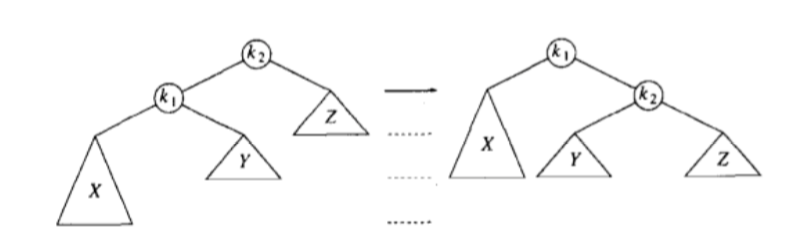

# AVL树
AVL树是满足一定平衡条件的二叉查找树。

平衡条件：`其每个节点的左右子树高度差最多为1`

插入操作可能会破坏平衡，需通过旋转来解决
假设必须重新平衡的节点叫做a，那么a的不平衡可能出现四种情况

> 1. 在a的左儿子的左子树插入
> 2. 在a的左儿子的右子树插入
> 3. 在a的右儿子的左子树插入
> 4. 在a的右儿子的右子树插入

可以看出，1和4镜像对称，是发生在“外边”的情况，通过一次单旋转来完成调整，2和3镜像对称，是发生在“内部”的情况，通过双旋转来处理。

### 单旋转

### 双旋转
对于情形2，要左-右双旋，即先左旋，再右旋
对于情形3，要右-左双旋

### 编程基本思路
为将关键字是X的一个新节点插入到一颗AVL树T中去，我们递归地将X插入到T的相应子树（称为T.LR）。如果T.LR高度不变，那么插入完成，否则，如果在T中出现高度不平衡，那么做适当的旋转。

