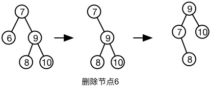

# AVL树

## 概念
AVL树是满足一定平衡条件的二叉查找树。

平衡条件：`其每个节点的左右子树高度差最多为1`

插入操作可能会破坏平衡，需通过旋转来解决
假设必须重新平衡的节点叫做a，那么a的不平衡可能出现四种情况

> 1. 在a的左儿子的左子树插入
> 2. 在a的左儿子的右子树插入
> 3. 在a的右儿子的左子树插入
> 4. 在a的右儿子的右子树插入

可以看出，1和4镜像对称，是发生在“外边”的情况，通过一次单旋转来完成调整，2和3镜像对称，是发生在“内部”的情况，通过双旋转来处理。

**单旋转**


**双旋转**


## 实现
### 树节点的定义

```swift
public class TreeNode<T: Comparable> {
    private var value: T
    private var height: Int
    private var left: TreeNode?
    private var right: TreeNode?
    private var parent: TreeNode?
    
    public init(value: T) {
        self.value = value
        self.height = 1
    }
}
```
我这里叶子节点的高度为1
### AVL树的定义

```swift
public class AVLTree<T: Comparable> {
    private var root: TreeNode<T>? {
        didSet {
            root?.parent = nil
        }
    }
    
    public init() {
        
    }
    
    public convenience init(array: Array<T>) {
        self.init()
        for value in array {
            insert(value)
        }
    }
}
```
这里要提一下的就是当根被替换时，需要将新根的`parent`设为nil，因为`parent`为nil是判断该节点为根的依据

### 辅助方法

```swift
private func reconnectParentFromNode(node: TreeNode<T>, toNode: TreeNode<T>?)
```
这个方法将`node`及其子书替换为`toNode`及其子树，如图所示
`recconectParentFromNode(9, 8)`


```swift
private func reconnectLeftChildFromNode(node: TreeNode<T>, toNode: TreeNode<T>)
private func reconnectRightChildFromNode(node: TreeNode<T>, toNode: TreeNode<T>)
```
这两个方法别是将`node`的左右儿子链接到`toNode`的左右儿子

### 旋转
左旋转

```swift
private func leftRotateAtNode(node: TreeNode<T>) {
    let rightNode = node.right!
    
    reconnectParentFromNode(node, toNode: rightNode)
    
    node.right = rightNode.left
    rightNode.left?.parent = node
    
    rightNode.left = node
    node.parent = rightNode
    
    node.resetHeight()
    rightNode.resetHeight()
}
```
左右双旋

```swift
private func leftRightRotateAtNode(node: TreeNode<T>) {
    leftRotateAtNode(node.left!)
    rightRotateAtNode(node)
}
```

### 创建和插入
树的创建就是在根节点执行插入

```swift
public func insert(value: T) {
    if let root = root {
        insertAtNode(root, withValue: value)
    }else {
        root = TreeNode.init(value: value)
    }
}

private func insertAtNode(node: TreeNode<T>, withValue value: T) {
    if value < node.value {
        if let left = node.left {
            insertAtNode(left, withValue: value)
        }else {
            node.left = TreeNode.init(value: value)
            node.left!.parent = node
        }
        if !node.isBalance {
            if value < node.left!.value {
                rightRotateAtNode(node)
            }else {
                leftRightRotateAtNode(node)
            }
        }

    }else if value > node.value {
        if let right = node.right {
            insertAtNode(right, withValue: value)
        }else {
            node.right = TreeNode.init(value: value)
            node.right!.parent = node
        }
        if !node.isBalance {
            if value > node.right!.value {
                leftRotateAtNode(node)
            }else {
                rightLeftRotateAtNode(node)
            }
        }
    }
    
    node.resetHeight()
}
```

### 删除
同插入，删除就是在根节点执行删除
删除分为两种情况

* 删除叶子节点
* 删除非叶子节点

若为叶子节点，直接删除
若为非叶子节点，则用右子树的最小节点来取代这个节点


删除完毕后，树可能会失去平衡，需要重新调节平衡。这里的思路是，若在左子树上的删除使得该节点失衡，则可以看成是在右节点上的插入使得该节点失衡，然后通过旋转来调节

在左子树上进行删除，判断右子树的左右儿子高度，左儿子高度小于右儿子高度，看成是在右子树的右儿子插入，通过一次左旋转调节

在左子树上进行删除，判断右子树的左右儿子高度，左儿子高度大于右儿子高度，看成是在右子树的左儿子插入，通过一次右左双旋调节

这种情况是右子树的左右儿子高度相同，这种情况只需一次左旋转调节

```swift
public func delete(value: T) {
    if let root = root {
        deleteAtNode(root, value: value)
    }
}
    
private func deleteAtNode(node: TreeNode<T>, value: T) {
    if value == node.value {
        if let rightMinNode = findMinAtNode(node.right) {
            if rightMinNode === node.right {
                reconnectParentFromNode(node, toNode: rightMinNode)
                reconnectLeftChildFromNode(node, toNode: rightMinNode)
            }else {
                node.value = rightMinNode.value
                reconnectParentFromNode(rightMinNode, toNode: nil)
            }
        }else {
            reconnectParentFromNode(node, toNode: node.left)
        }
    }else if value < node.value {
        let left = node.left!
        deleteAtNode(left, value: value)
        if !node.isBalance {
            guard let right = node.right else { return }
            if right.leftChildHeight > right.rightChildHeight {
                rightLeftRotateAtNode(node)
            }else {
                leftRotateAtNode(node)
            }
        }
    }else {
        let right = node.right!
        deleteAtNode(right, value: value)
        if !node.isBalance {
            guard let left = node.left else { return }
            if left.leftChildHeight < left.rightChildHeight {
                leftRightRotateAtNode(node)
            }else {
                rightRotateAtNode(node)
            }
        }
    }
    
    node.resetHeight()
}
```
### 查找
查找比较简单，二分法的思路

```swift
    private func search(value: T) -> TreeNode<T>?{
        var node = root
        while node != nil {
            if value < node!.value {
                node = node!.left
            }else if value > node!.value {
                node = node!.right
            }else {
                return node
            }
        }
        return nil
    }
    
    private func findMinAtNode(node: TreeNode<T>?) -> TreeNode<T>? {
        guard var node = node else { return nil }
        while case let next? = node.left {
            node = next
        }
        return node
    }
    
    private func findMaxAtNode(node: TreeNode<T>?) -> TreeNode<T>? {
        guard var node = node else { return nil }
        while case let next? = node.right {
            node = next
        }
        return node
    }
```
