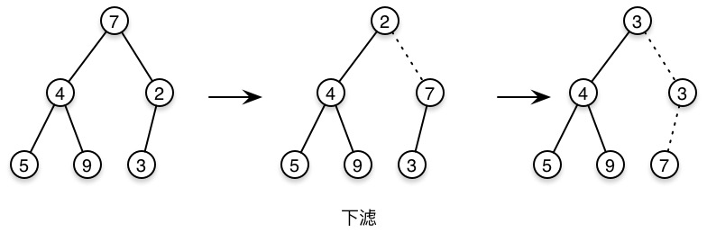

# 二叉堆

### 结构性质

二叉堆是一颗完全二叉树

 

容易得出结论：

* 一颗高为h的完全二叉树，有2^h到2^(h+1) - 1个节点
* 对于位置i，左儿子在2i，右儿子在2i+1，父亲在i/2

### 堆序性质

任意节点值小于它的所有后裔

 

### 堆操作的两个关键方法

#### 上滤


```swift
private mutating func percolateUpAtIndex(index: Int) {
    assert(index < elements.count)
    let element = elements[index]
    var i = index
    var child = i
    while i != 0 && elements[(i - 1) / 2] > element {
        elements[i] = elements[(i - 1) / 2]
        child = i
        i = (i - 1) / 2
    }
    if i == 0 {
        if elements[0] > element {
            elements[child] = elements[0]
        }else {
            i = child
        }
    }
    elements[i] = element
}
```


#### 下滤  

```swift
private mutating func percolateDownAtIndex(index: Int, lastElementIndex: Int) {
    assert(index < elements.count)
    let element = elements[index]
    let lastElement = elements[lastElementIndex]
    var i = index
    
    while i * 2 + 1 < elements.count {
        var child = 2 * i + 1
        if child != elements.count - 1 && elements[child + 1] < elements[child] {
            child += 1
        }
        if elements[child] < lastElement{
            elements[i] = elements[child]
        }else {
            break
        }
        i = child
    }
    elements[i] = lastElement
    elements[lastElementIndex] = element
}
```


### 基本操作

#### 插入

在数组末尾插入，然后对其进行上滤操作

```swift
public mutating func insert(element: T) {
    elements.append(element)
    percolateUpAtIndex(elements.count - 1)
}
```

#### 建堆

依序执行插入即可

```swift
private mutating func buildHeap(array: [T]) {
    for element in array {
        insert(element)
    }
}
```

#### 删除最小元

将数组第一个元素替换为数组的最后一个元素，对第一个元素进行下滤操作，最后删除数组最后一个元素即可

```swift
public mutating func deleteMin() {
    assert(elements.count > 0)
    percolateDownAtIndex(0, lastElementIndex: elements.count - 1)
    elements.removeLast()
}
```

