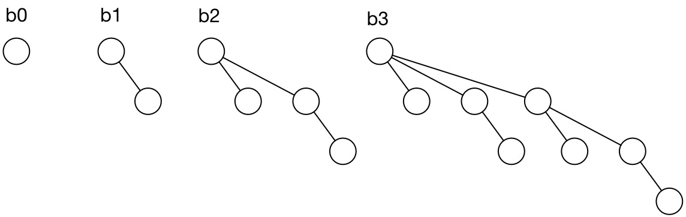
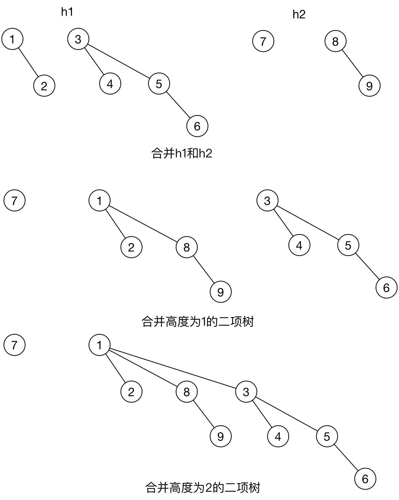

# 二项队列

二项队列（binomial queue）是堆序树的集合，成为森林，堆序树中的每一棵都具有约束的形式，叫做二项树（binomial tree）。

**二项树**

高度为0的二项树是一颗单节点树，高度为k的二项树通过将高度为k-1的二项树链接到另一棵高度为k-1的二项树的根上而构成。 

同样，每个二项树都具有堆序性质

### 基本操作

#### 合并

将两个二项队列中高度相同的二项树两两相加，形成新的二项队列



直到没有高度相同的二项树，合并完成

二项队列的合并方法

```swift
public func merge(queue: BinomialQueue<T>) {
    if queue.forest.count == 0 {
        return
    }else if forest.count == 0 {
        forest = queue.forest
    }else {
        if queue.forest.count > forest.count {
            forest.appendContentsOf(Array.init(count: queue.forest.count - forest.count, repeatedValue: nil))
        }
        var temp: BinNode<T>?
        for i in 0..<forest.count {
            let node1 = forest[i]
            let node2: BinNode<T>?
            if i >= queue.forest.count {
                node2 = nil
            }else {
                node2 = queue.forest[i]
            }
            
            switch (node1, node2, temp) {
            case (nil, nil, nil): temp = nil
            case (_, nil, nil): temp = nil
            case (nil, _, nil):
                forest[i] = node2
                temp = nil
            case (nil, nil, _):
                forest[i] = temp
                temp = nil
            case (_, _, nil):
                temp = combine(node1!, withNode: node2!)
                forest[i] = nil
            case (_, nil, _):
                temp = combine(node1!, withNode: temp!)
                forest[i] = nil
            case (nil, _, _):
                temp = combine(node2!, withNode: temp!)
            case (_, _, _):
                forest[i] = temp
                temp = combine(node1!, withNode: node2!)
            }
        }
        if let temp = temp {
            forest.append(temp)
        }
    }
    queue.removeAll()
}
```

树的合并方法

```swift
func combine(node: BinNode<T>, withNode: BinNode<T>) -> BinNode<T> {
    if node.value > withNode.value {
        return combine(withNode, withNode: node)
    }
    withNode.nextSibling = node.firstChild
    node.firstChild = withNode
    node.height += 1
    return node
}
```

#### 插入

插入是合并的特殊情形，即和一个单节点的队列合并

```swift
public func insert(value: T) {
    var forest = [BinNode<T>?]()
    forest.append(BinNode<T>.init(value: value))
    let queue = BinomialQueue<T>.init()
    queue.forest = forest
    merge(queue)
}
```

#### 删除最值

1. 遍历二项队列个树的根，寻找最小值
2. 将该树丛二项队列删去得到新的队列h1
3. 将树的根节点删去，子树们形成新的队列2
4. 合并h1和h2得到目标队列

```swift
public func deleteMin() -> T?{
    var minNode: BinNode<T>?
    var minIndex = 0
    for i in 0..<forest.count {
        if let node = forest[i] {
            if minNode == nil {
                minNode = node
                minIndex = i
            }else if node.value < minNode!.value{
                minNode = node
                minIndex = i
            }
        }
    }
    guard let deleteNode = minNode else { return nil}
    let deleteQueue = BinomialQueue<T>.init(count: minIndex)
    if let firstChild =  deleteNode.firstChild{
        deleteQueue.forest[firstChild.height] = firstChild
        var node = firstChild
        while case let next? = node.nextSibling {
            deleteQueue.forest[next.height] = next
            node = next
        }
    }
    forest[minIndex] = nil
    merge(deleteQueue)
    return deleteNode.value
}
```

