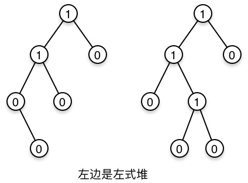
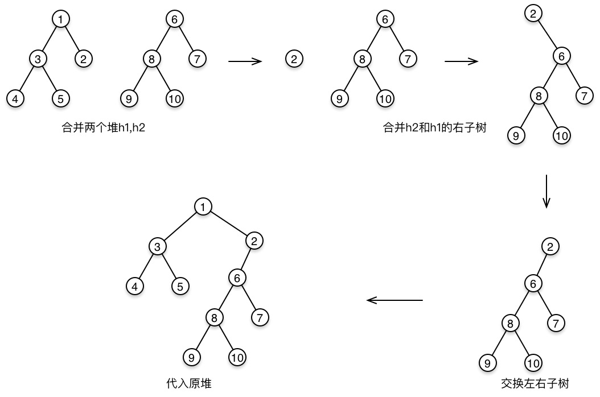

# 左式堆

### 结构性质

`NPL（零路径长）`：任一节点X到一个没有两个儿子的节点的最短路径的长

对于堆中的每一个节点X，左儿子的NPL至少与右儿子的NPL一样大

 

### 堆序性质

同二叉堆

### 左式堆的关键操作-合并

合并两个堆h1，h2

1. 若有一个堆是空的，返回另一个堆
2. 将根较大的堆与另一堆的右子树合并
3. 若合并后堆失序，交换左右子树
4. 根的NPL = 右子树NPL + 1



```swift
func merge(node: HeapNode<T>, intoNode root: HeapNode<T>) -> HeapNode<T> {
    guard let left = root.left else {
        root.left = node
        return root
    }
    root.right = merge(root.right, withNode: node)
    if left.npl < root.right!.npl {
        swapChildren(root)
    }
    root.npl = root.right!.npl + 1
    return root
}

func merge(node: HeapNode<T>?, withNode: HeapNode<T>?) -> HeapNode<T>? {
    guard let node1 = node else { return withNode }
    guard let node2 = withNode else { return node }
    if node1.value < node2.value {
        return merge(node2, intoNode: node1)
    }else{
        return merge(node1, intoNode: node2)
    }
}
```

### 插入

插入式合并的特例，即将一个堆与一个节点合并

```swift
public func insert(value: T) {
        let node = HeapNode<T>.init(value: value)
        root = merge(root, withNode: node)
    }
```

### 删除最值

因为堆序性质，最值都位于根节点，这里只需要删除根节点，然后将左右子树合并，并返回合并后的堆

```swift
public func deleteMin() {
        root = merge(root?.left, withNode: root?.right)
    }
```

